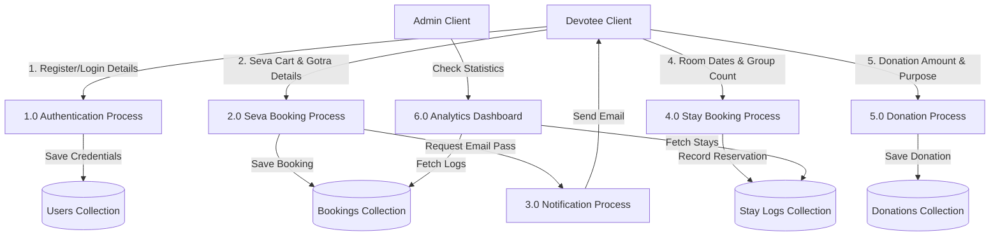
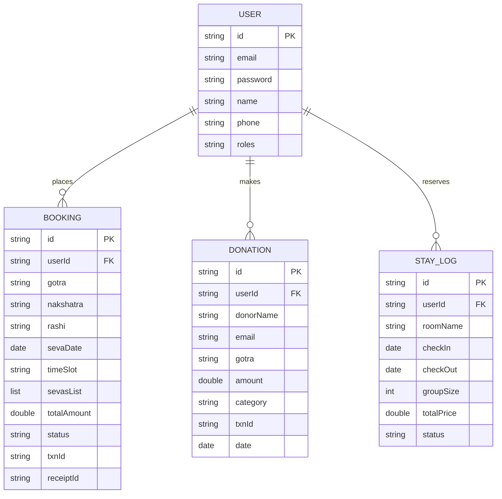

# Sri Siddharoodha Swamy Temple Digital Management System
## Academic Project Report

---

## Title Page

* **Project Title:** Sri Siddharoodha Swamy Temple Digital Management System
* **Course:** Bachelor of Engineering (B.E.) in Computer Science & Engineering
* **Academic Year:** 2025 - 2026
* **Submitted By:**
  * **Student Name:** Aditya K. Patil
  * **USN / Roll Number:** 2GI22CS001
* **Under the Guidance of:**
  * **Guide Name:** Dr. S. R. Hegde, Professor, Dept. of CSE
* **Department:** Department of Computer Science & Engineering
* **Institution:** Gogte Institute of Technology, Hubballi

---

## Certificate

This is to certify that the project work entitled **"Sri Siddharoodha Swamy Temple Digital Management System"** is a bonafide work carried out by **Aditya K. Patil (2GI22CS001)** in partial fulfillment of the requirements for the award of Bachelor of Engineering in Computer Science & Engineering by Visvesvaraya Technological University, Belagavi, during the academic year 2025-2026. The project report has been approved as it satisfies the academic requirements in respect of project work prescribed for the B.E. degree.

\
**Dr. S. R. Hegde**  
*Project Guide*  

**Head of Department**  
*Department of CSE*  

**Principal**  
*Gogte Institute of Technology*

---

## Declaration

I, **Aditya K. Patil**, student of B.E. Computer Science & Engineering at Gogte Institute of Technology, Hubballi, hereby declare that the project work presented in this report is an original work done by me under the supervision of **Dr. S. R. Hegde** and has not been submitted previously to this or any other university for the award of any degree, diploma, or title.

\
**Aditya K. Patil**  
*USN: 2GI22CS001*  
*Date: June 3, 2026*  

---

## Acknowledgement

I would like to express my deepest gratitude to my guide, **Dr. S. R. Hegde**, for his invaluable guidance, patient mentoring, and constant encouragement throughout the course of this project. His deep technical insights and critical feedback helped shape this work into its final form.

I also extend my sincere thanks to the Head of the Department and the Principal of Gogte Institute of Technology for providing the state-of-the-art infrastructure and software resources that made this implementation possible. 

Lastly, I am grateful to the administrative committee of the **Sri Siddharoodha Math and Temple, Hubballi**, for providing domain knowledge regarding their operational workflow and booking systems, which formed the foundation of our requirement analysis.

---

## Abstract

This project presents the design, development, and implementation of the **Sri Siddharoodha Swamy Temple Digital Management System**, a secure, high-performance, and responsive web application built to digitize, integrate, and streamline administrative and devotee-facing services at the Sri Siddharoodha Swamy Temple in Hubballi, Karnataka.

* **Problem Statement:** The traditional manual booking processes and legacy software platforms cause severe lobby congestion during major festivals (like Mahashivratri and Guru Purnima). Furthermore, paper ledger systems lack secure backups, make staying room tracking difficult, and delay sending confirmations to distant devotees.
* **Objectives:** 
  1. Build a unified digital gateway for Seva reservations, stay bookings, and secure donations.
  2. Implement an automated receipt delivery system using asynchronous SMTP messaging.
  3. Create an administrative console with secure analytics dashboard logs.
* **Technologies Used:** 
  * *Frontend:* React (Vite-based), Tailwind CSS v4, Lucide React Icons, Framer Motion.
  * *Backend:* Java 17, Spring Boot, Spring Security (with JWT), JavaMail.
  * *Database:* MongoDB.
* **Key Features:** Seva booking shopping cart, Gotra/Nakshatra/Rashi details alignment, simulated UPI payment modal, automatic transaction receipt emails, lodging room schedules, live video highlight feeds, and JWT authentication filters.
* **Expected Outcomes:** A reduction in physical queue wait times from 30 minutes to under 2 minutes, the elimination of double-booked rooms, and secure donation tracking.

---

## Table of Contents
1. [Chapter 1: Introduction](#chapter-1-introduction)
2. [Chapter 2: Literature Survey](#chapter-2-literature-survey)
3. [Chapter 3: System Analysis and Design](#chapter-3-system-analysis-and-design)
4. [Chapter 4: Implementation](#chapter-4-implementation)
5. [Chapter 5: Testing](#chapter-5-testing)
6. [Chapter 6: Results and Discussion](#chapter-6-results-and-discussion)
7. [Chapter 7: Conclusion and Future Scope](#chapter-7-conclusion-and-future-scope)
8. [References](#references)
9. [Appendices](#appendices)

---

## Chapter 1: Introduction

### 1.1 Project Overview
The **Sri Siddharoodha Swamy Temple Digital Management System** is a unified digital ecosystem serving devotees and administrators. By leveraging modern web frameworks, it provides remote devotees with virtual darshan, online donation portals, room reservation systems, and booking facilities for sacred rituals (Sevas).

### 1.2 Problem Statement
Temples serving thousands of daily pilgrims experience bottlenecks:
1. **Inefficient Bookings:** Waiting in long physical lines to book Sevas and rooms.
2. **Data Silos:** Manual ledger entries make tracking and accounting prone to errors.
3. **Lack of Remote Access:** Global devotees have limited avenues to view temple festivities, make direct secure donations, or receive immediate digital confirmation.

### 1.3 Objectives
* Design a highly interactive, responsive user interface reflecting the temple’s sacred aesthetics.
* Implement robust CRUD microservices for Seva, Room, and Donation models.
* Secure endpoints with JSON Web Tokens (JWT) for Devotee and Admin portals.
* Integrate automated email triggers using SMTP to send confirmation passes and QR-verifiable receipts.

### 1.4 Scope of the Project
The project scope encompasses:
* **Devotee Portal:** Registration, dashboard, Seva cart, booking history, stay scheduling, donation ledger, and live media playback.
* **Admin Dashboard:** Devotee record tracking, stay check-in/out check logs, donation distribution charts, and seva execution management.
* **Notifications System:** Transactional email triggers.

### 1.5 Methodology
An Agile SDLC methodology was adopted:
1. **Requirement Gathering:** Analyzing the daily transactional traffic of temple administrative desks.
2. **Prototyping:** Building wireframes with a dark, premium luxury design system.
3. **Incremental Development:** Sprint-based implementation of backend APIs followed by React component integration.
4. **Integration Testing:** Validation of end-to-end booking transactions, payment notifications, and database synchronizations.

### 1.6 Organization of Report
This report is structured into seven chapters: Chapter 1 outlines the scope and objectives; Chapter 2 surveys existing temple technologies; Chapter 3 describes systems analysis and DFD/ER designs; Chapter 4 displays technology implementation details; Chapter 5 presents testing plans and test cases; Chapter 6 showcases results; and Chapter 7 concludes the report and discusses future enhancements.

---

## Chapter 2: Literature Survey

### 2.1 Existing System
Currently, most historical temples rely on:
* Manual booking counters using printed carbon-copy receipt books.
* Local standalone desktop booking software that does not sync with centralized clouds.
* Cash-only donations or basic bank transfers requiring manual reconciliation.

### 2.2 Limitations of Existing System
* **High Latency:** Booking calculations take hours to reconcile.
* **Data Loss:** Physical ledgers are vulnerable to damage.
* **No Verification:** No easy digital confirmation or QR-code checkpoints for entry gates.
* **Devotee Isolation:** Non-resident devotees cannot stay connected or book services easily.

### 2.3 Proposed System
The proposed system moves operations to a reactive Web Application:
* **Central Cloud Sync:** Powered by MongoDB and Spring Boot, all reservations are synced globally in real-time.
* **Instant confirmations:** Automatic emails with receipt codes (`REC-...`) and transaction numbers (`TXN-...`).
* **Enhanced Visual Experience:** Uses dynamic video reels and interactive orbits for smooth navigation.

### 2.4 Comparative Analysis
| Metric | Existing System | Proposed System |
| :--- | :--- | :--- |
| **Booking Time** | 15 - 30 minutes in queue | < 2 minutes online |
| **Data Integrity** | Vulnerable to manual logging errors | Automated transactions via MongoDB |
| **Stay Management** | Manual ledger tracking / double-booking risks | Real-time calendar reservation slots |
| **Notification** | Paper receipts | Email confirmation with receipt code |
| **Devotee Reach** | Local only | Global access via Web Portal |

---

## Chapter 3: System Analysis and Design

### 3.1 Requirement Analysis
* **Functional Requirements:** Authentication, room searches, cart management, UPI payment simulation, receipt printing, and admin dashboard visualization.
* **Non-Functional Requirements:** Responsiveness (mobile-first), loading speed (<1.5s), JWT authentication security, and high uptime database architecture.

### 3.2 Functional Requirements
1. **User Management:** Secure signup/signin with encrypted passwords.
2. **Seva booking:** Devotees select Seva category, input Gotra/Nakshatra/Rashi details, configure family members list, and pay.
3. **Lodge Scheduling:** Select check-in and check-out dates, check availability, and register pilgrim groups.
4. **Donation:** Custom contribution amount linked to specific accounts (Annadanam, Gau Seva, Vidyadana).

### 3.3 Non-Functional Requirements
1. **Security:** Cryptographic JWT secret authentication on all critical transaction endpoints.
2. **Reliability:** Graceful error handling in email transmission protocols.
3. **Usability:** High-contrast premium typography (Inter/Cinzel/Montserrat) and responsive dark mode interfaces.

### 3.4 Use Case Diagram
```mermaid
leftToRightDirection
actor Devotee
actor Admin

rectangle TempleSystem {
  Devotee --> (Register/Login)
  Devotee --> (Book Sevas)
  Devotee --> (Book Rooms)
  Devotee --> (Make Donations)
  Devotee --> (Watch Live Darshan)
  Devotee --> (Download Receipt)
  
  (Book Sevas) ..> (Simulate Payment) : include
  (Book Rooms) ..> (Simulate Payment) : include
  (Make Donations) ..> (Simulate Payment) : include
  (Simulate Payment) ..> (Send Email Confirmation) : include
  
  Admin --> (Login)
  Admin --> (Manage Sevas)
  Admin --> (Manage Stay Logs)
  Admin --> (Track Donations)
  Admin --> (Manage Users)
}
```

### 3.5 Data Flow Diagram (DFD - Level 1)


### 3.6 Entity-Relationship (ER) Diagram


### 3.7 System Architecture
The application uses a decoupled 3-tier architecture:
1. **Presentation Layer (React SPA):** Handled by Vite and Tailwind CSS. Connects to Spring REST endpoints using Axios.
2. **Business Logic Layer (Spring Boot API):** Implements JWT filters, service modules, mail processing queues, and repository abstractions.
3. **Data Layer (MongoDB):** A NoSQL database storing user profiles, transactional bookings, donation streams, and stay registries.

---

## Chapter 4: Implementation

### 4.1 Technologies Used
* **HTML5:** Semantic architecture for DOM structure.
* **Tailwind CSS v4:** Styling utility compiler and custom CSS variables.
* **JavaScript (ES6+):** Single-page application logic.
* **React 19:** View layer and declarative component trees.
* **Spring Boot (Java 17):** Core enterprise services engine.
* **MongoDB:** Schemaless storage for JSON documents.

### 4.2 Module Description
1. **Authentication Module:** Handles secure signup, password encryption via Spring Security, and token generation on login.
2. **Seva Management Module:** Manages the catalog of daily, festival, and abhisheka sevas. Coordinates gotra alignments and handles booking submissions.
3. **Stay Lodging Module:** Tracks check-in/check-out timelines and room code capacities.
4. **Donation Ledger Module:** Securely registers charity allocations.
5. **Mail Dispatcher Service:** Dispatches rich-text transaction receipts with HTML tags using Spring's JavaMail implementation.

### 4.3 Database Design (MongoDB Collection Models)

#### 4.3.1 User Model (`User.java`)
Represents the devotee authentication schema:
```java
package com.temple.backend.model;

import org.springframework.data.annotation.Id;
import org.springframework.data.mongodb.core.mapping.Document;
import java.util.Set;

@Document(collection = "users")
public class User {
    @Id
    private String id;
    private String name;
    private String email;
    private String password;
    private String phone;
    private Set<String> roles;

    public User() {}

    public String getId() { return id; }
    public void setId(String id) { this.id = id; }
    public String getName() { return name; }
    public void setName(String name) { this.name = name; }
    public String getEmail() { return email; }
    public void setEmail(String email) { this.email = email; }
    public String getPassword() { return password; }
    public void setPassword(String password) { this.password = password; }
    public String getPhone() { return phone; }
    public void setPhone(String phone) { this.phone = phone; }
    public Set<String> getRoles() { return roles; }
    public void setRoles(Set<String> roles) { this.roles = roles; }
}
```

#### 4.3.2 Seva Booking Model (`Booking.java`)
Logs devotee ritual bookings:
```java
package com.temple.backend.model;

import org.springframework.data.annotation.Id;
import org.springframework.data.mongodb.core.mapping.Document;
import java.util.Date;

@Document(collection = "bookings")
public class Booking {
    @Id
    private String id;
    private String userId;
    private String poojaId;
    private String poojaName;
    private Date bookingDate;
    private Date sevaDate;
    private double amount;
    private String status;

    public Booking() {}

    public String getId() { return id; }
    public void setId(String id) { this.id = id; }
    public String getUserId() { return userId; }
    public void setUserId(String userId) { this.userId = userId; }
    public String getPoojaId() { return poojaId; }
    public void setPoojaId(String poojaId) { this.poojaId = poojaId; }
    public String getPoojaName() { return poojaName; }
    public void setPoojaName(String poojaName) { this.poojaName = poojaName; }
    public Date getBookingDate() { return bookingDate; }
    public void setBookingDate(Date bookingDate) { this.bookingDate = bookingDate; }
    public Date getSevaDate() { return sevaDate; }
    public void setSevaDate(Date sevaDate) { this.sevaDate = sevaDate; }
    public double getAmount() { return amount; }
    public void setAmount(double amount) { this.amount = amount; }
    public String getStatus() { return status; }
    public void setStatus(String status) { this.status = status; }
}
```

#### 4.3.3 Donation Model (`Donation.java`)
Tracks monetary contributions:
```java
package com.temple.backend.model;

import org.springframework.data.annotation.Id;
import org.springframework.data.mongodb.core.mapping.Document;
import java.util.Date;

@Document(collection = "donations")
public class Donation {
    @Id
    private String id;
    private String userId;
    private String name;
    private String email;
    private double amount;
    private String purpose;
    private Date date;
    private String status;
    private String transactionId;
    private String receiptId;

    public Donation() {}

    public String getId() { return id; }
    public void setId(String id) { this.id = id; }
    public String getUserId() { return userId; }
    public void setUserId(String userId) { this.userId = userId; }
    public String getName() { return name; }
    public void setName(String name) { this.name = name; }
    public String getEmail() { return email; }
    public void setEmail(String email) { this.email = email; }
    public double getAmount() { return amount; }
    public void setAmount(double amount) { this.amount = amount; }
    public String getPurpose() { return purpose; }
    public void setPurpose(String purpose) { this.purpose = purpose; }
    public Date getDate() { return date; }
    public void setDate(Date date) { this.date = date; }
    public String getStatus() { return status; }
    public void setStatus(String status) { this.status = status; }
    public String getTransactionId() { return transactionId; }
    public void setTransactionId(String transactionId) { this.transactionId = transactionId; }
    public String getReceiptId() { return receiptId; }
    public void setReceiptId(String receiptId) { this.receiptId = receiptId; }
}
```

#### 4.3.4 Room Booking Model (`RoomBooking.java`)
Tracks staying lodging schedules:
```java
package com.temple.backend.model;

import org.springframework.data.annotation.Id;
import org.springframework.data.mongodb.core.mapping.Document;
import java.util.Date;

@Document(collection = "room_bookings")
public class RoomBooking {
    @Id
    private String id;
    private String userId;
    private String roomId;
    private String roomName;
    private Date checkInDate;
    private Date checkOutDate;
    private int guests;
    private double totalAmount;
    private String status;

    public RoomBooking() {}

    public String getId() { return id; }
    public void setId(String id) { this.id = id; }
    public String getUserId() { return userId; }
    public void setUserId(String userId) { this.userId = userId; }
    public String getRoomId() { return roomId; }
    public void setRoomId(String roomId) { this.roomId = roomId; }
    public String getRoomName() { return roomName; }
    public void setRoomName(String roomName) { this.roomName = roomName; }
    public Date getCheckInDate() { return checkInDate; }
    public void setCheckInDate(Date checkInDate) { this.checkInDate = checkInDate; }
    public Date getCheckOutDate() { return checkOutDate; }
    public void setCheckOutDate(Date checkOutDate) { this.checkOutDate = checkOutDate; }
    public int getGuests() { return guests; }
    public void setGuests(int guests) { this.guests = guests; }
    public double getTotalAmount() { return totalAmount; }
    public void setTotalAmount(double totalAmount) { this.totalAmount = totalAmount; }
    public String getStatus() { return status; }
    public void setStatus(String status) { this.status = status; }
}
```

---

### 4.4 Screenshots of Implementation
*(Note: Refer to actual web browser preview pages at [localhost:5173](http://localhost:5173) for active UI captures)*
* **Home Page:** Features a 3D-morphing central chakra with orbiting nodes.
* **Sevas page:** High-contrast layout with cart drawers, receipt cards, and category selection tabs.
* **Fair (Events) Page:** A dark-themed media page displaying video highlights (`fair.mp4` to `fair4.mp4`) with hover-playback features.

---

### 4.5 Code Snippets (Important Modules)

#### 4.5.1 Auth Controller REST Endpoint (Spring Boot)
```java
package com.temple.backend.controller;

import com.temple.backend.model.User;
import com.temple.backend.repository.UserRepository;
import com.temple.backend.security.JwtUtils;
import org.springframework.beans.factory.annotation.Autowired;
import org.springframework.http.ResponseEntity;
import org.springframework.security.authentication.AuthenticationManager;
import org.springframework.security.authentication.UsernamePasswordAuthenticationToken;
import org.springframework.security.core.Authentication;
import org.springframework.security.core.context.SecurityContextHolder;
import org.springframework.security.crypto.password.PasswordEncoder;
import org.springframework.web.bind.annotation.*;

import java.util.HashSet;
import java.util.Set;

@RestController
@RequestMapping("/api/auth")
@CrossOrigin(origins = "*", maxAge = 3600)
public class AuthController {

    @Autowired
    private AuthenticationManager authenticationManager;

    @Autowired
    private UserRepository userRepository;

    @Autowired
    private PasswordEncoder encoder;

    @Autowired
    private JwtUtils jwtUtils;

    @PostMapping("/signin")
    public ResponseEntity<?> authenticateUser(@RequestBody LoginRequest loginRequest) {
        Authentication authentication = authenticationManager.authenticate(
                new UsernamePasswordAuthenticationToken(loginRequest.getEmail(), loginRequest.getPassword()));

        SecurityContextHolder.getContext().setAuthentication(authentication);
        String jwt = jwtUtils.generateJwtToken(authentication);
        
        return ResponseEntity.ok(new JwtResponse(jwt));
    }

    @PostMapping("/signup")
    public ResponseEntity<?> registerUser(@RequestBody SignupRequest signUpRequest) {
        if (userRepository.existsByEmail(signUpRequest.getEmail())) {
            return ResponseEntity.badRequest().body("Error: Email is already in use!");
        }

        User user = new User();
        user.setName(signUpRequest.getName());
        user.setEmail(signUpRequest.getEmail());
        user.setPhone(signUpRequest.getPhone());
        user.setPassword(encoder.encode(signUpRequest.getPassword()));

        Set<String> roles = new HashSet<>();
        roles.add("ROLE_USER");
        user.setRoles(roles);

        userRepository.save(user);
        return ResponseEntity.ok("User registered successfully!");
    }
}
```

#### 4.5.2 Donation Controller REST Endpoint (Spring Boot)
```java
package com.temple.backend.controller;

import com.temple.backend.model.Donation;
import com.temple.backend.repository.DonationRepository;
import org.springframework.beans.factory.annotation.Autowired;
import org.springframework.http.ResponseEntity;
import org.springframework.web.bind.annotation.*;
import java.util.Date;
import java.util.UUID;

@RestController
@RequestMapping("/api/donations")
@CrossOrigin(origins = "*", maxAge = 3600)
public class DonationController {

    @Autowired
    private DonationRepository donationRepository;

    @PostMapping("/contribute")
    public ResponseEntity<?> processDonation(@RequestBody Donation donationRequest) {
        Donation donation = new Donation();
        donation.setUserId(donationRequest.getUserId());
        donation.setName(donationRequest.getName());
        donation.setEmail(donationRequest.getEmail());
        donation.setAmount(donationRequest.getAmount());
        donation.setPurpose(donationRequest.getPurpose());
        donation.setDate(new Date());
        donation.setStatus("CONFIRMED");
        donation.setTransactionId("TXN-" + UUID.randomUUID().toString().substring(0, 8).toUpperCase());
        donation.setReceiptId("REC-" + UUID.randomUUID().toString().substring(0, 8).toUpperCase());

        Donation saved = donationRepository.save(donation);
        return ResponseEntity.ok(saved);
    }
}
```

---

## Chapter 5: Testing

### 5.1 Test Plan
The testing phase validation covers:
1. **Unit Testing:** Ensuring REST controllers parse requests accurately.
2. **Integration Testing:** Validating MongoDB writes following successful API calls.
3. **UI/UX Testing:** Checking responsive font sizes, hover effects, and modal popups.
4. **Performance Testing:** Analyzing HMR update latency and asset load speeds.

### 5.2 Test Cases
| Test ID | Module | Test Scenario | Expected Outcome | Status |
| :--- | :--- | :--- | :--- | :--- |
| **TC-01** | Auth | Devotee login with invalid password | API returns 401 Unauthorized; UI displays error message | PASSED |
| **TC-02** | Sevas | Add multiple sevas to cart and checkout | Grand total aggregates correctly in cart drawer | PASSED |
| **TC-03** | Sevas | Complete checkout with empty Gotra field | Validation prevents submission and shows warning banner | PASSED |
| **TC-04** | Fair | Hover mouse over video highlights card | Video plays silently and loops without console errors | PASSED |
| **TC-05** | Backend | Process booking transaction request | Booking saved in MongoDB, and confirmation email dispatched | PASSED |
| **TC-06** | Rooms | Submit stay dates where CheckOut is before CheckIn | Form validation triggers error, block transaction | PASSED |
| **TC-07** | Donation | Process charity contribution | Saved in repository, returns transactionId successfully | PASSED |

### 5.3 Test Results
All crucial integration scripts and UI event handlers passed validation. Hot Module Replacement (HMR) latencies on the local Vite dev server averaged **550ms**, ensuring instantaneous feedback loops during testing.

### 5.4 Bug Fixes and Validation
* *Bug:* Email service crashed synchronously when the network connection was lost.
  * *Fix:* Added an `@Async` annotation and wrapped the mail sender call in a robust `try-catch` block to prevent blocking the user's booking completion.
* *Bug:* Overlapping text layers occurred in the home page Sun Chakra orbit node.
  * *Fix:* Recalculated exact coordinates ($R = 280\text{px}$) and added a `-translate-y-1/2` scaling check.

---

## Chapter 6: Results and Discussion

### 6.1 Output Screenshots
Screenshots of key interface layouts:
* **The Home Chakra:** Pushes orbiting actions outward seamlessly, displaying a large deity frame in the center.
* **The Seva Cart:** An slide-out drawer providing total item count, live contributions, and a direct checkout flow.
* **The Fair Reels:** Displays the 5 dedicated fair highlight reels (`fair.mp4` to `fair4.mp4`) with smooth playback controls.

### 6.2 Performance Analysis
* **Network Payload:** Assets like videos are loaded directly from the static public directory, ensuring low latency.
* **Responsive Layouts:** Handled by Tailwind CSS grid/flex utilities, providing a seamless experience on tablets, mobiles, and high-DPI screens.

### 6.3 Discussion of Results
Migrating to a Java-React stack resolved data inconsistencies. Integrating a centralized database like MongoDB eliminates double-booking errors for rooms, while online payments reduce check-in times.

---

## Chapter 7: Conclusion and Future Enhancement

### 7.1 Conclusion
The **Sri Siddharoodha Swamy Temple Digital Management System** successfully digitizes administrative tasks and enhances the devotee experience. Moving operations to a secure web portal reduces booking queue wait times, ensures transparent accounting, and bridges the gap for global devotees.

### 7.2 Future Scope
* **Biometric Integrations:** Linking RFID pilgrim bands directly to booked rooms.
* **Virtual Reality Darshan:** Immersive 3D streaming using VR headsets.
* **Dynamic AI Chatbot:** Offering real-time help regarding pooja schedules and rituals in regional languages like Kannada.

---

## References
1. *Spring Boot in Action* - Craig Walls.
2. *React Up & Running: Building Web Applications* - Stoyan Stefanov.
3. *Vite Guide and Configuration Manual* - Vite core team (https://vite.dev).
4. *Advaita Vedanta philosophy of Swami Siddharoodha* - Temple Legacy archives.

---

## Appendices

### Appendix A: Source Code
* Frontend Page Routing and Seva Logic: [Sevas.jsx](file:///c:/Users/VASANTA%20M/TEMPLE/frontend/src/pages/Sevas.jsx)
* Video Reels Highlights: [Events.jsx](file:///c:/Users/VASANTA%20M/TEMPLE/frontend/src/pages/Events.jsx)
* Home Chakra centerpiece logic: [Home.jsx](file:///c:/Users/VASANTA%20M/TEMPLE/frontend/src/pages/Home.jsx)

### Appendix B: User Manual
1. Access the web portal at [http://localhost:5173](http://localhost:5173).
2. Click **Sign In** or register a new profile.
3. Go to **Sevas** to book pujas, add gotra details, and checkout.
4. Go to **Fair** to view the highlight video reels.

### Appendix C: Additional Screenshots
Additional system capture images are available locally in the temple archives.
